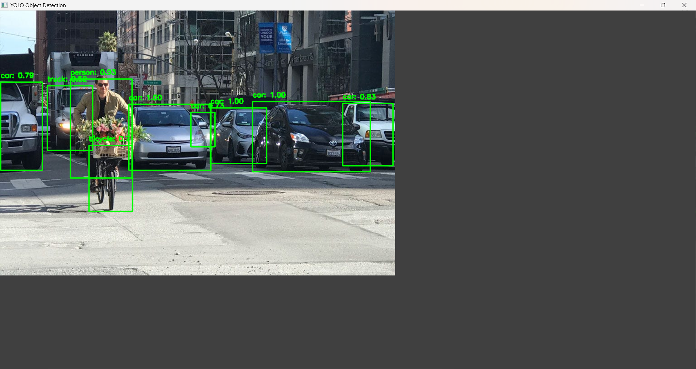

# Object Detection Using YOLO and OpenCV

This project demonstrates real-time object detection using the YOLOv3 model with OpenCV and Python. It can detect multiple objects in images or webcam video streams with high accuracy.

## Features
- Real-time object detection
- Pre-trained YOLOv3 model
- Easy to run on both images and live webcam
- Simple and clean code

## Requirements
- Python 3.x
- NumPy
- OpenCV
- OpenCV-Contrib

## Installation

Clone the repository and install the required Python packages:

```bash
git clone https://github.com/shahbaaz09/object-detection-ai.git
cd object-detection-ai
pip install -r requirements.txt
```

## Usage

To detect objects in an image:

```bash
python detect.py --image test_images/sample.jpg
```

To detect objects from your webcam:

```bash
python detect.py --webcam
```

> Ensure the following files are in the project folder:
> - `yolov3.cfg`
> - `yolov3.weights`
> - `coco.names`

## Sample Output
This is a sample result of the YOLOv3 object detection running in real-time:




## Project Structure

```
object-detection-ai/
├── detect.py
├── yolov3.cfg
├── yolov3.weights
├── coco.names
├── test_images/
├── results/
├── requirements.txt
└── README.md
```

## License
This project is for educational and non-commercial use only.

## Author
**Shahbaaz**
- GitHub: [shahbaaz09](https://github.com/shahbaaz09)
- LinkedIn: [Mohammad Shahbaaz Shaikh](https://www.linkedin.com/in/mohammad-shahbaaz-shaikh-2725192b7?utm_source=share&utm_campaign=share_via&utm_content=profile&utm_medium=android_app)
